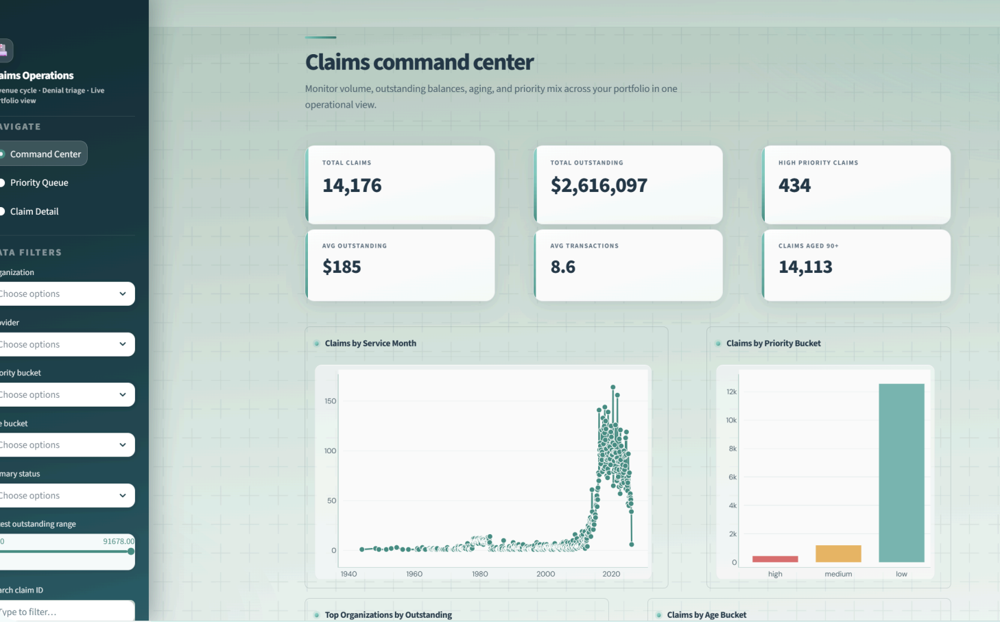
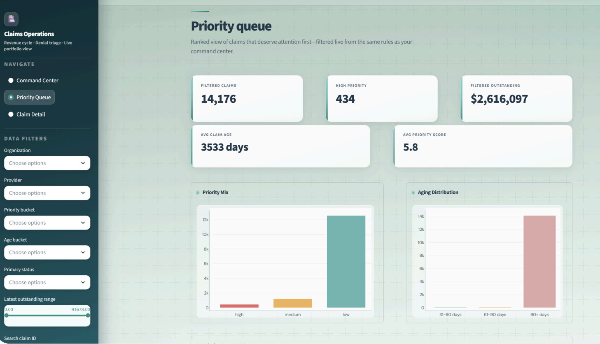
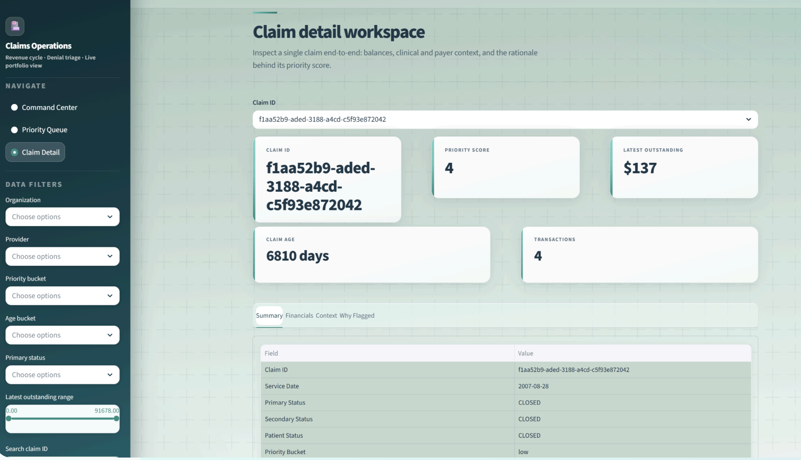

# Healthcare Claims Operations & Revenue Risk Platform 🏥

> An **end-to-end analytics platform** built on the modern data stack. Synthea synthetic healthcare data → DuckDB warehouse → dbt transformations (sources → staging → intermediate → marts) → a Streamlit + Plotly operations UI that surfaces **$2.6M outstanding across 14,176 claims** and ranks which ones need attention first.


<p align="center">
  
</p>

> **📄 [Full slide deck (PDF)](./Healthcare%20Claims%20Operations%20%26%20Revenue%20Risk%20Platform.pdf)** - problem framing, architecture, design choices, and UI walkthrough.

---

## 🎯 The Problem

Claims and transaction data are **fragmented across tables** - it's hard to see a claim's resolution posture quickly. Revenue-cycle teams need to know, in one glance:

- **Where the dollars sit** - open balances, aged claims, concentration risk
- **What's aging** - what's been open 30 / 60 / 90+ days
- **What's complex** - high transaction counts, unusual payer/provider patterns
- **Who it clusters on** - which organizations, providers, and payers drive the biggest outstanding balances

Without a shared decision layer, teams fall back on **ad-hoc SQL, inconsistent definitions, and tribal rules** for what counts as "urgent."

### Why it matters

| Dimension | Cost of getting it wrong |
|---|---|
| 💰 **Cash & capacity** | Open and aged claims delay money and burn limited team time |
| 🎯 **Wrong focus = risk** | Without a shared priority view, effort misses high-balance, high-complexity hotspots |
| 🤝 **Trust** | One repeatable definition of *"urgent"* beats a patchwork of ad-hoc SQL |

---

## 📦 Data & Scope

**Dataset: [Synthea](https://synthetichealth.github.io/synthea/) synthetic healthcare data** - a realistic population simulator that generates CSVs with the *shape* of real healthcare data but zero actual PHI. Safe to share publicly, safe to host anywhere.

Nine tables are in scope - the rest were intentionally left out to keep the project focused on **ops and revenue risk**, not general healthcare analytics:

| Table | Why it's in scope | How it's used |
|---|---|---|
| `claims` | Core business object | Claim grain: status, service date, identifiers |
| `claims_transactions` | Financial activity around claims | Rollups: payments, adjustments, transfers |
| `patients` | Person context | Demographics and geography for encounters |
| `encounters` | Visit / service context | Links claims to utilization patterns |
| `payers` | Coverage context | Payer dimension for portfolio views |
| `providers` | Performer context | Provider dimension + concentration analysis |
| `organizations` | Facility context | Org-level outstanding balances |
| `procedures` | Service detail | Procedure context where relevant |
| `conditions` | Clinical context | Diagnosis/condition flags for context |

---

## 🏗️ End-to-End Architecture

<p align="center">
  
</p>

**Five stages, one design principle:** business logic lives in the warehouse (DuckDB + dbt). The app reads from curated marts - it doesn't compute.

1. **Ingest** - download Synthea CSV extracts, load shortlisted tables into DuckDB (`load_to_duckdb.py`)
2. **Verify** - row counts + sanity checks (`inspect_schema.py`, `table_schema_summary.csv`)
3. **Model** - dbt runs the four-layer transformation: sources → staging → intermediate → marts
4. **Serve** - mart tables are the **stable interface** between warehouse and app; schema changes are versioned through dbt, not the UI
5. **Experience** - Streamlit + Plotly render monitoring, ranking, and drill-down from the marts

---

## 🧱 dbt Transformation Layer

<p align="center">
  
</p>

### Layer 1 - **Sources**
DuckDB tables registered in dbt via YAML declarations.

### Layer 2 - **Staging** (`stg_*`)
Standardize naming (snake_case), cast types, keep only relevant fields, add foundational tests (`not_null` on keys, `unique` where expected).

### Layer 3 - **Intermediate**
Two key models do the heavy lifting:

- **`int_claim_financials`** - aggregates transactions to the claim grain: payments, adjustments, transfers, totals, latest outstanding balance, transaction count, first/last transaction dates.
- **`int_claim_enriched`** - joins claims with the financial summary, adds patient/provider/org context, and computes derived analytical fields (age buckets, complexity signals, concentration flags).

### Layer 4 - **Marts** (app-ready)
- **`mart_claim_priority_queue`** - one row per claim, ranked by priority score and enriched with every field the queue view needs
- **`mart_claims_overview`** - aggregated portfolio view for the command center KPIs

**Why the separation:** the app is dumb and fast. Priority logic is **readable SQL in dbt**, not Python buried inside a Streamlit callback. Change the definition of *"urgent"* in one place and both views update on the next `dbt run`.

---

## 🖥️ Streamlit Application

The app is organized as a **three-step operational workflow**: monitor → prioritize → investigate.

### 1. Claims Command Center
KPIs and trends at a glance - volume, total outstanding, aging distribution, priority mix, top attention list.

> `14,176` total claims · `$2,616,097` outstanding · `434` high-priority · `14,113` aged 90+ days

<p align="center">
  
</p>

### 2. Priority Queue
A **ranked work surface** telling the team what to review first. Filtered live from the same rules as the command center - no silent divergence between views.

<p align="center">
  
</p>

### 3. Claim Detail Workspace
One claim, end-to-end: balances, financial rollup, clinical and payer context, and - crucially - a **"why flagged" explanation** that names the specific rule(s) that put the claim on the queue. Transparent, auditable, no black-box.

<p align="center">
  
</p>

### Operational UX
Global sidebar filters work across all three pages: organization, provider, priority bucket, age bucket, primary status, latest-outstanding range, and a claim-ID search.

---

## 🧭 Design Decisions

### Why these three tools?

| Tool | Why it fits |
|---|---|
| **DuckDB** | One-file SQL engine - fast joins and rollups, zero server ops, easy to ship as a portfolio piece |
| **dbt** | Repeatable, testable, documented transformations - metrics live in versioned models, not scattered notebook cells |
| **Streamlit** | Fast Python UI for filters, charts, and tables that mostly *reads* from curated tables |

### What I optimized for

- **Right question first** - focus on balances, payments, and open work, not *"every healthcare table."*
- **Logic in the warehouse** - the app displays; DuckDB + dbt own the math.
- **Layered models** - clean raw → connect → final reporting tables that people can trust.
- **Tight scope** - only the sources that serve ops + revenue risk. Less noise, faster delivery.
- **Synthea on purpose** - realistic data shape, zero PHI, safe to share and host publicly.
- **Explainable outputs** - flags and segments are tied to visible numbers, not black-box ML.
- **Easy to rerun or host** - simple dependencies and a clean run path so it's portable when needed.

---

## 🏆 Outcomes & Differentiators

| Dimension | What this project demonstrates |
|---|---|
| 🧠 **Analytics engineering** | Business logic lives in versioned, testable dbt models - not buried in UI code |
| 📊 **Business usability** | Revenue-risk signals made *operational*: balance, age, complexity, concentration - not just dashboards |
| 🎯 **Judgment** | Reframed the problem to match the available data; shortlisted tables with intent rather than dumping every source |
| 🛠️ **Product thinking** | Workflow-shaped app: **monitor → prioritize → investigate** - not a generic multi-tab dashboard |

---

## 🛠️ Tech Stack

| Layer | Tools |
|---|---|
| Language | Python 3.10+, SQL |
| Warehouse | DuckDB (embedded, single-file) |
| Transformations | dbt-duckdb (sources, staging, intermediate, marts) |
| App | Streamlit |
| Visualization | Plotly |
| Data | Synthea synthetic healthcare CSV extracts |

## 🚀 Getting Started

### 1. Clone and set up

```bash
git clone https://github.com/Isha2605/healthcare-claims-operations-revenue-risk-platform.git
cd healthcare-claims-operations-revenue-risk-platform

python -m venv venv
source venv/bin/activate          # macOS / Linux
# venv\Scripts\activate           # Windows

pip install -r requirements.txt
```

### 2. Load Synthea data into DuckDB

Download a Synthea CSV extract from <https://synthea.mitre.org/downloads> (the "synthea_sample_data_csv" bundle works well), unzip it under `data/`, then:

```bash
python load_to_duckdb.py
python inspect_schema.py   # optional sanity check
```

This produces `warehouse/claims.duckdb` (ignored by git) with the nine shortlisted tables loaded.

### 3. Run dbt

```bash
cd dbt_project
dbt deps
dbt seed                 # if you're using any seed CSVs
dbt run
dbt test
```

### 4. Launch the Streamlit app

```bash
cd ../app
streamlit run app.py
```

Open <http://localhost:8501>.

## 📁 Project Structure

```
├── app/                          # Streamlit operations UI
│   └── app.py                    # entrypoint with three views
├── assets/                       # Architecture diagrams (SVG)
│   ├── ppt-architecture-horizontal.svg
│   └── ppt-dbt-layer-cake.svg
├── data/                         # Raw Synthea CSV extracts (gitignored)
├── dbt_project/                  # dbt transformation layer
│   ├── models/
│   │   ├── staging/              # stg_* - cleaned, typed, tested
│   │   ├── intermediate/         # int_claim_financials, int_claim_enriched
│   │   └── marts/                # mart_claim_priority_queue, mart_claims_overview
│   ├── tests/
│   ├── dbt_project.yml
│   └── profiles.yml
├── docs/                         # Supporting documentation
├── notebooks/                    # Exploration notebooks
├── screenshots/                  # App screenshots (for this README)
├── warehouse/                    # DuckDB files (gitignored)
├── inspect_schema.py             # Schema inventory + sanity checks
├── load_to_duckdb.py             # CSV → DuckDB loader
├── load_to_duckdb.txt            # Load notes
├── table_schema_summary.csv      # Table schema reference
└── README.md
```

## 🔒 Data Note

The project uses **Synthea synthetic data** - a fully simulated population created by MITRE. **No real patient health information is used or stored**, which means:

- Safe to share the full repo publicly
- Safe to host the app without HIPAA infrastructure
- Realistic data *shape* for demonstrating healthcare analytics patterns without the risk surface of real PHI

If adapting this pipeline to real healthcare data, you'd need to add: HIPAA-compliant hosting, row-level access controls in the warehouse, audit logging on the Streamlit app, and credentialed-user authentication.


## 🔮 Future Work

- [ ] **Authentication** on the Streamlit app (Streamlit's native auth or an external identity provider)
- [ ] **Live refresh** - replace manual `dbt run` with a scheduled trigger (dbt Cloud, GitHub Actions, or Prefect)
- [ ] **Forecasting** - project outstanding balances 30 / 60 / 90 days forward per org
- [ ] **Collection-action recommendations** - extend the priority score into a "next best action" field
- [ ] **Snowflake / BigQuery** port - swap the dbt target to demonstrate cloud-warehouse portability
- [ ] **Data contracts** - formalize the mart schemas as contracts so downstream consumers can depend on them

## 📬 Contact

**Isha Narkhede** · [Portfolio](https://isha-n-portfolio.netlify.app/) · [LinkedIn](https://linkedin.com/in/isha-narkhede) · ishajayant207@gmail.com

## 📝 License

MIT - see [LICENSE](LICENSE).
